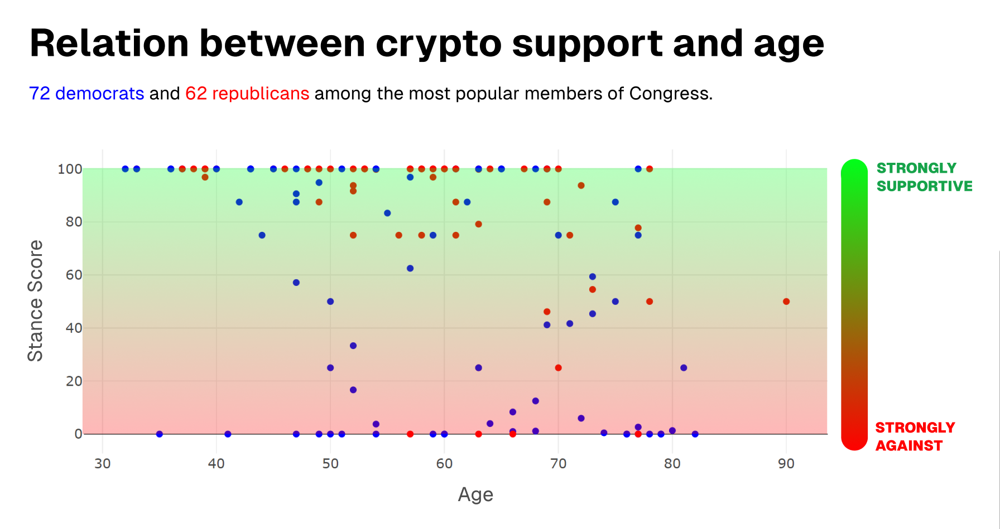

# StandWithCrypto.org data analysis



To install dependencies:

```bash
bun install
```

To run:

```bash
bun run main.ts
```

This project was created using `bun init` in bun v1.1.3. [Bun](https://bun.sh).
